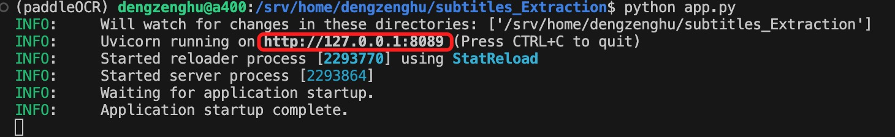
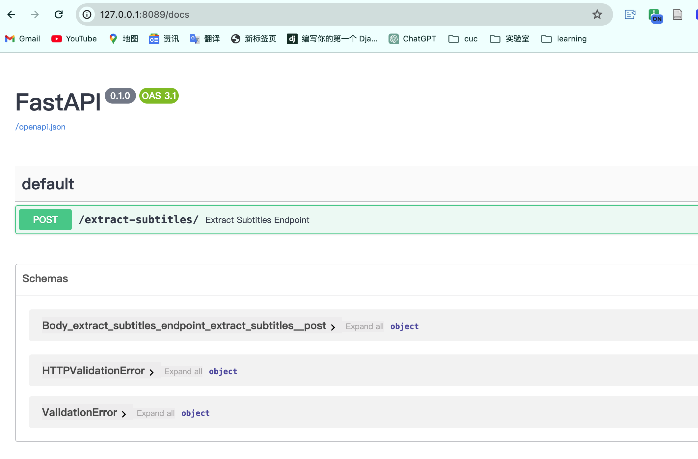
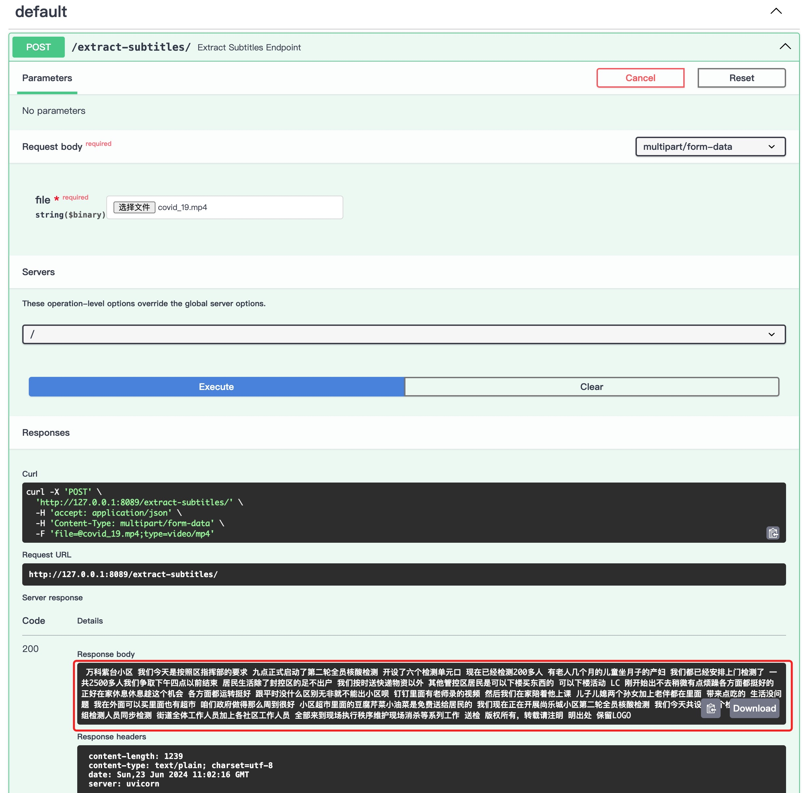

# Subtitles_Extraction：借助paddleOCR识别提取视频字幕

## 实现逻辑

该项目的具体功能为实现视频字幕的提取。总体实现思路即使用`ffmpeg`提取视频单帧，选定字幕区域后利用`paddleOCR`识别视频帧的字幕信息。具体实现的逻辑步骤如下：

1. 使用ffmpeg从视频中提取帧

   - 对于视频的处理一般都会转换为对图像的处理，所以首先会将视频转换为图像帧。`ffmpeg` 是一个开源的多媒体处理工具，用于录制、转换和流式传输音视频。因为是用于识别视频字幕，所以在设置参数时默认设置为一秒提取一帧图像（`fps=1`）

     ```python
     ffmpeg -i /path/to/video.mp4 -vf fps=1 ./video_frames/video/frame_%04d.png
     ```

   - 不过一秒一帧实际上还是会有重复的帧，导致识别的时候提取相同的字幕。因此，后续还需要对提取的字幕信息做去重处理。

2. 选取字幕区域，对每一帧进行OCR识别

   - 常规视频字幕的放置区域在画幅下方，因此经过简单的测试和调研，将字幕区域定义在图像底部20%的部分。（实际上这种硬编码的方式有待优化，万一遇到特殊情况还得改代码，通用性不足。最好是能够改进到用户可自行选择字幕区域）。

   - 通过两点（**左上角、右下角**）确定矩形字幕区域，把画幅放在坐标系上的第四象限。规定了字幕区域在整个图像底部的20%部分，因此左上角的x坐标为0，y坐标为0.8倍的图像高，右下角的x坐标为图像的宽，y坐标为图像的高。

     ```python
     image = Image.open(img_path)
     width, height = image.size
     subtitle_area = (0, int(height * (1 - subtitle_height_ratio)), width, height)
     cropped_image = image.crop(subtitle_area)
     ```

   - 图示

     假设图像的高度为1000像素，`subtitle_height_ratio`为0.2，即20%：

     - 图像高度的80%处：`1000 * 0.8 = 800`
     - 字幕区域的坐标：(0, 800, width, 1000)

     ```python
     ┌────────────────────────────┐
     │                            │
     │                            │
     │                            │
     │                            │
     │                            │
     │                            │
     │                            │
     │                            │
     │                            │
     ├────────────────────────────┤  <- 高度的80%处（y = 800）
     │                            │
     │     字幕区域 (20%)         │
     │                            │
     └────────────────────────────┘  <- 底部（y = 1000）
     
     ```

     

3. 处理OCR结果并去重。使用`SequenceMatcher`进行去重，确保相似度高于0.8的字幕不会重复添加。

   ```python
       if result:
           current_subtitle = " ".join([line[1][0] for res in result for line in res if len(line) > 1 and len(line[1]) > 0])
           current_subtitle_cleaned = ' '.join(current_subtitle.split())
           if not any(SequenceMatcher(None, current_subtitle_cleaned, old_subtitle).ratio() > 0.8 for old_subtitle in recognized_subtitles):
               recognized_subtitles.append(current_subtitle_cleaned)
               full_subtitle_text += current_subtitle_cleaned + " "
   ```


## 环境准备

1. 安装paddleOCR、FastAPI、uvicorn

   ```bash
   pip install fastapi paddleocr uvicorn
   ```

2. 在系统上安装命令行工具ffmpeg

   ```bash
   # on Ubuntu or Debian
   sudo apt update && sudo apt install ffmpeg
   
   # on Arch Linux
   sudo pacman -S ffmpeg
   
   # on MacOS using Homebrew (https://brew.sh/)
   brew install ffmpeg
   
   # on Windows using Chocolatey (https://chocolatey.org/)
   choco install ffmpeg
   
   # on Windows using Scoop (https://scoop.sh/)
   scoop install ffmpeg
   
   ```


## 运行

1. 本地运行app.py

```bash
python app.py
```

2. 在浏览器中输入地址 http://127.0.0.1/docs 即可正常访问API接口

   

   

3. 点击`try it out`后选择要提取字幕的视频文件，再点击`Execute`即可在下方`Response body`查看提取出的字幕信息

   